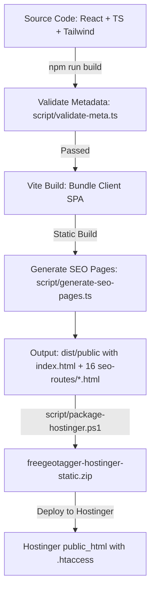
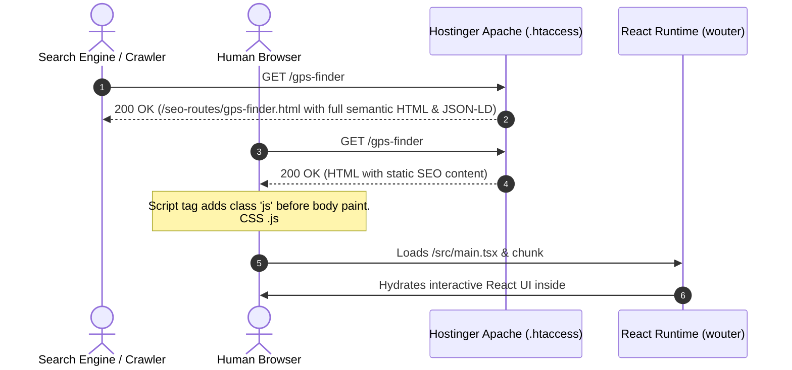

# FreeGeoTagger — Architecture & System Design

**Document Version:** 1.0.0 (Phase 1 Audit Baseline)  
**Last Updated:** 2026-09-11  
**Target Domain:** [https://freegeotagger.com](https://freegeotagger.com)

---

## 1. System Overview & Philosophy

FreeGeoTagger is a free, privacy-first, client-side web utility designed for viewing, adding, editing, and verifying geographic EXIF metadata in photos.

### Core Architectural Principles
1. **Local-First Processing:** Image parsing, coordinate injection, and file assembly execute 100% in the user's browser via JavaScript. The original image bytes never leave the client device.
2. **Deterministic & Testable:** EXIF parsing, rational coordinate transformation, and output verification follow strict binary specifications without arbitrary abstractions.
3. **Crawlable & Fast:** Public pages are pre-rendered into semantic static HTML for search engines and answer engines (AEO/GEO), while providing a zero-CLS, responsive single-page application experience for human users.
4. **No Server-Side Image Liability:** No image uploads, no cloud storage, no database requirements, and no retention of user photo or coordinate data.

---

## 2. Current Tech Stack Inventory

| Layer | Technology | Version | Purpose | Evaluation / Notes |
|---|---|---|---|---|
| **Runtime / Language** | TypeScript | 5.6.3 | Type safety across client, build scripts, and server | Active, healthy |
| **Frontend Framework** | React | 18.3.1 | Core UI component tree and reactive state | Standard production grade |
| **Routing** | wouter | 3.3.5 | Lightweight SPA client-side routing (~1.5 KB) | Minimal overhead compared to react-router |
| **Build Tooling** | Vite | 7.3.0 | Fast bundling, HMR, and production tree-shaking | Modern, optimized rollup pipeline |
| **CSS & Styling** | Tailwind CSS | 3.4.17 | Utility-first responsive styling and typography | Fast, clean utility system |
| **UI Components** | Radix UI / shadcn | Diverse | Accessible UI primitives (dialogs, toasts, tooltips) | Standard WCAG compliant primitives |
| **Metadata Engine** | piexifjs | 1.0.6 | EXIF reading and writing for JPEG/TIFF | Core workhorse; lacks direct PNG/WebP chunk support |
| **HEIC Decoding** | heic2any | 0.0.4 | Converts Apple HEIC photos to JPEG | Heavy (~1.35 MB chunk), lazy-loaded on demand |
| **File Saving** | file-saver | 2.0.5 | Client-side blob saving | Standard utility |
| **Batch Packaging** | jszip | 3.10.1 | Client-side ZIP archive creation for batch downloads | Lazy-loaded on batch download |
| **Mapping Engine** | Leaflet | 1.9.4 | Interactive map, draggable pin, tile rendering | Loaded dynamically from `/vendor/leaflet.esm.js` |
| **Tiles & Geocoding** | OpenStreetMap / Nominatim | Public API | Map tiles and place search/reverse geocoding | Direct client calls; needs provider abstraction |
| **Analytics** | GA4 (`G-BWMMC6PP63`) | Consent Mode v2 | Anonymous traffic and route-change metrics | Strict privacy; zero coordinates/images collected |
| **Deployment Target** | Hostinger Apache | Linux/Apache | Static asset serving, rewrites, HTTP headers, caching | Deployed via static ZIP to `public_html` |
| **Dev/Script Server** | Express | 5.0.1 | Local development server and fallback routing | No backend `/api` endpoints; dev/script utility |

---

## 3. Hosting & Deployment Pipeline

FreeGeoTagger is deployed as a **high-performance static site on Hostinger Apache hosting**.

### Build & Deploy Sequence
1. **Metadata Enforcement (`script/validate-meta.ts`):** Fails the build immediately if any canonical route has a title outside 50–60 characters, description outside 140–160 characters, or contains duplicate meta tags sitewide.
2. **Client Build (`vite build`):** Generates production JavaScript, CSS, and hashed assets in `dist/public`.
3. **Prerender Generation (`script/generate-seo-pages.ts`):** Extracts semantic HTML, structured data schemas, and metadata from `client/src/lib/seo.ts` and page components, outputting 16 static HTML pages in `dist/public/seo-routes/` and prerendered content into `dist/public/index.html`.
4. **Packaging (`script/package-hostinger.ps1`):** Normalizes directory separators to forward slashes (`/`), validates required files (`.htaccess`, `robots.txt`, `sitemap.xml`, `llms.txt`, `ads.txt`, `404.html`), and creates `freegeotagger-hostinger-static.zip`.
5. **Apache `.htaccess` Handling:**
   - Enforces 301 redirect from `www.freegeotagger.com` to non-www `https://freegeotagger.com`.
   - Intercepts requests for clean routes (e.g. `/gps-finder`, `/blog/*`, `/privacy`) and serves the corresponding prerendered HTML from `/seo-routes/*.html` with status 200.
   - Sets aggressive caching (1 year immutable) for hashed CSS, JS, fonts, and images.
   - Sets `max-age=0, must-revalidate` for HTML, XML, and TXT files.
   - Injects security headers: HSTS, `X-Content-Type-Options: nosniff`, `X-Frame-Options: SAMEORIGIN`, `Referrer-Policy: strict-origin-when-cross-origin`, and `Permissions-Policy`.

---

## 4. Prerendering & Client Hydration Architecture

Search engine crawlers and browsers receive crawlable HTML directly on the first packet.

---

## 5. Image Metadata Architecture

### Current Implementation Flow
1. **File Intake:** Accepts JPG/JPEG, PNG, WebP, and HEIC up to 20 MB.
2. **HEIC Handling:** Automatically converts HEIC to JPEG via `heic2any` before metadata processing.
3. **Format-Specific EXIF Injection:**
   - **JPEG:** Converts file to Data URL, calls `piexif.load()`, modifies GPS IFD (Latitude, Longitude, Altitude, Ref tags, Version ID `[2,3,0,0]`), dumps EXIF binary, and replaces EXIF segment with `piexif.insert()`.
   - **PNG:** Extracts original bytes, strips existing `eXIf` chunks, computes CRC-32 over `eXIf` payload, and inserts the chunk directly after the 33-byte `IHDR` header without canvas re-encoding.
   - **WebP:** Parses RIFF chunks, updates `VP8X` feature flags (bit 3 set for EXIF presence), inserts `EXIF` chunk into chunk sequence, and reconstructs the RIFF header without canvas re-encoding.
4. **Delivery:** Creates Blob URL for instant download or batches into a ZIP via `jszip`.

### Identified Architecture Gaps
- **Missing Verification Phase:** The engine currently assumes successful write without re-reading the generated binary to confirm that GPS latitude and longitude match expected rational values.
- **Main-Thread CPU Burden:** Data URL conversions and chunk manipulation occur on the main browser thread, causing UI drops during batch operations.
- **No Worker Offloading:** Web Workers are not yet implemented for batch image processing.

---

## 6. Map & Geocoding Architecture

- **Map Library:** Leaflet 1.9.4 loaded asynchronously on first photo upload.
- **Tiles:** Direct requests to `https://{s}.tile.openstreetmap.org/{z}/{x}/{y}.png`.
- **Search & Reverse Geocoding:** Direct `fetch()` calls to `https://nominatim.openstreetmap.org/search`.
- **Critical Risk:** Direct client-side calls to public Nominatim without rate-limiting, proxying, or provider abstraction violate OSM policies under production scale.

---

## 7. Security, Privacy & Compliance Architecture

- **Privacy Invariant:** Zero photo bytes or location data leave the browser.
- **Analytics Isolation:** GA4 events never include image filenames, coordinates, addresses, or metadata payloads.
- **Consent Readiness:** Google Consent Mode v2 loaded in `<head>` with default denied status. Cookie banner manages local storage preference.
- **Dead Server Code:** Express server has no exposed APIs, but repository retains obsolete Drizzle ORM and authentication scaffold dependencies that should be cleaned in subsequent phases.
