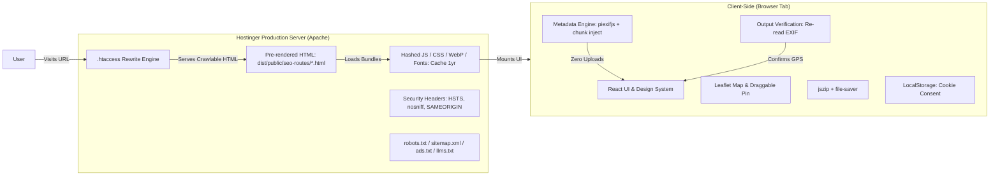
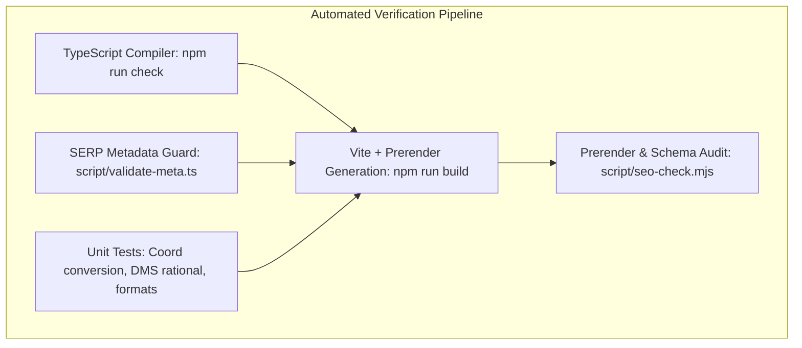

# FreeGeoTagger — Technical Architecture & Safe Refactor Plan

**Document Version:** 2.0.0 (Phase 2 Architecture Decision Baseline)  
**Last Updated:** 2026-09-11  
**Target Domain:** [https://freegeotagger.com](https://freegeotagger.com)  
**Status:** APPROVED FOR PHASED IMPLEMENTATION

---

## 1. System Overview & Core Philosophy

FreeGeoTagger is a free, privacy-first, client-side web application designed to view, add, edit, and verify geographic EXIF metadata in photos.

### Core Architectural Invariants
1. **Local-First Processing:** Image parsing, EXIF decoding, coordinate injection, and binary reconstruction execute 100% inside the user's browser. Original image bytes never leave the client device under standard workflows.
2. **Deterministic & Testable:** EXIF parsing, rational coordinate transformation, and output verification follow strict binary specifications with automated regression tests.
3. **Crawlable & Zero-CLS:** All public pages are statically pre-rendered into crawlable semantic HTML with validated JSON-LD schema for search engines and answer engines (AEO/GEO), while providing a zero-CLS, responsive single-page application experience for human visitors.
4. **No Unnecessary Infrastructure:** No database, no user accounts, no server-side photo storage, and zero tracking of location coordinates.

---

## 2. Framework Architecture Decision: Keep vs Migrate

### Evaluation & Evidence Summary

| Consideration | Option A: Migrate to Next.js (App Router) | Option B: Improve Current Stack in Place (Vite + React + TS + Static Prerender) | Winner & Decision Rationale |
|---|---|---|---|
| **Hosting Target** | Requires persistent Node server or static export (`output: export`). Shared Hostinger Apache hosting cannot run Next.js server runtime without VPS migration. | Native static Apache deployment via `.htaccess`. Perfectly aligns with current Hostinger `public_html` upload workflow (`script/package-hostinger.ps1`). | **Option B (In Place)** |
| **SEO Risk & Crawlability** | High risk of subtle canonical, trailing slash, hydration mismatch, or routing changes that could jeopardize the 273 clicks / 5,016 impressions baseline. | Zero routing drift. 17/17 URLs are already prerendered, return 200 OK, and have strict SERP title/desc length validation. | **Option B (In Place)** |
| **Performance & Bundle** | Next.js client runtime adds ~80–110 KB framework baseline; SSR server cold starts on cheap hosts can degrade TTFB. | Vite 7 tree-shakes cleanly. Static Apache delivery provides sub-50ms TTFB. Heavy libs (`heic2any`, `jszip`, `leaflet`) are already code-split. | **Option B (In Place)** |
| **Maintenance Simplicity** | High maintenance overhead; frequent App Router breaking changes and deployment lock-in. | Extremely simple, deterministic pipeline: Vite client build + TS prerender script + Apache `.htaccess`. | **Option B (In Place)** |

### Architectural Decision
**DECISION: IMPROVE CURRENT STACK IN PLACE.**  
Do not migrate framework. Retain and refine **React 18 + Vite 7 + TypeScript 5 + Tailwind CSS + wouter**, coupled with the custom static prerendering engine (`script/generate-seo-pages.ts`) and Apache `.htaccess` routing.

---

## 3. Server / Client Boundary Definition



### Client Responsibilities
- 100% of user photo intake, thumbnail generation, EXIF parsing, and coordinate injection.
- Re-reading generated output binaries to guarantee embedded GPS coordinates match user intent.
- Interactive map rendering, draggable marker handling, and manual decimal/DMS coordinate toggling.
- Client-side ZIP compilation and file download triggering.
- Consent state persistence (`fgt-cookie-consent`).

### Server Responsibilities (Hostinger Static Apache)
- Canonical enforcement: 301 redirection from `www` to non-www.
- URL routing: Rewriting clean canonical paths (`/gps-finder`, `/blog/*`, `/privacy`, etc.) to their respective prerendered static HTML files in `/seo-routes/*.html`.
- Asset caching: 1-year immutable caching for fingerprinted assets; immediate revalidation for HTML, XML, and TXT files.
- Security headers injection: HSTS, `X-Content-Type-Options: nosniff`, `X-Frame-Options: SAMEORIGIN`, `Referrer-Policy: strict-origin-when-cross-origin`, and `Permissions-Policy`.
- Zero file upload endpoints; zero image processing on server.

---

## 4. Local Image-Processing & Metadata Boundary

### Processing Lifecycle & Quality Guarantee
1. **Intake & Memory Management:**
   - Use `URL.createObjectURL()` instead of heavy base64 Data URLs for image thumbnails to minimize DOM memory footprint.
   - Always revoke object URLs on component unmount or image removal (`URL.revokeObjectURL()`).
2. **Format-Specific Pipeline:**
   - **JPEG / JPG:** Parse EXIF via `piexifjs`, modify GPS IFD rational tags and reference flags, write back via `piexif.insert()` without touching or recompressing DCT pixel coefficients (100% lossless).
   - **PNG:** Extract raw binary chunks, strip existing `eXIf` chunk, compute CRC-32 over new `eXIf` chunk containing `piexif`-formatted TIFF payload, and inject immediately following the 33-byte `IHDR` chunk. Zero canvas re-encoding; 100% pixel preserved.
   - **WebP:** Parse RIFF chunks, enable VP8X EXIF bit flag (bit 3), inject `EXIF` chunk into the payload stream, recalculate RIFF length headers. Zero re-encoding; 100% pixel preserved.
   - **HEIC:** Decoded and transcoded to high-quality JPEG (quality 0.95) via `heic2any` since browsers and standard EXIF viewers do not natively support local HEIF GPS injection. The UI must clearly label this conversion to the user.
3. **Mandatory Output Verification (Phase 5 Quality Differentiator):**
   - After metadata injection, the output Blob is immediately passed to an automated verification reader.
   - The reader parses the embedded EXIF GPS tags from the generated Blob, converts DMS rational coordinates back to decimal degrees, and compares them to the user's input coordinates.
   - The UI displays a verified badge only when the read-back coordinates match within tolerance ($\pm 0.0001^{\circ}$).

---

## 5. Map & Geocoding Provider Abstraction

To avoid hardcoded lock-in to OpenStreetMap tile servers or public Nominatim instances (and prevent policy violation risks under high traffic), mapping and geocoding are decoupled via standard TypeScript adapter interfaces:

```typescript
export interface PlaceResult {
  lat: number;
  lng: number;
  displayName: string;
  address?: Record<string, string>;
}

export interface GeocoderProvider {
  search(query: string): Promise<PlaceResult[]>;
  reverse(lat: number, lng: number): Promise<PlaceResult | null>;
}

export interface MapPickerAdapter {
  init(container: HTMLElement, options: { lat: number; lng: number; zoom: number }): void;
  setCoordinates(lat: number, lng: number): void;
  onCoordinatesChange(callback: (lat: number, lng: number) => void): void;
  destroy(): void;
}
```

### Implementation Strategy
- **Default Implementation:** Leaflet 1.9.4 loaded dynamically only when the user uploads a photo, paired with a debounced (500ms) Nominatim adapter.
- **Production Guardrail:** Enforce a minimum 3-character search query, debounce input by 500ms, and cache recent place queries in memory to stay within Nominatim usage guidelines.
- **Provider Interchangeability:** The interface allows seamless swapping to MapLibre, Stadia Maps, Protomaps, or Mapbox without modifying any UI components.

---

## 6. Content Architecture & Static Prerendering Engine

- **Single Source of Truth:** `client/src/lib/seo.ts` defines canonical URLs, titles, descriptions, and keywords for all pages.
- **Static Prerenderer (`script/generate-seo-pages.ts`):**
  - Reads `SEO_CONFIG` and the semantic content of page files.
  - Generates full static HTML containing semantic landmarks (`<main id="static-seo-content">`, `<article>`, `<h1>`, `<h2>`, `<p>`, `<table>`, `<ol>`).
  - Injects schema JSON-LD: `SoftwareApplication`, `WebPage`, `Organization`, `HowTo`, `FAQPage`, `BreadcrumbList`, and `Article`.
- **Client Hydration:**
  - `client/index.html` runs a minimal inline script before body paint: `document.documentElement.className += ' js';`.
  - CSS rule `.js #static-seo-content { display: none !important; }` hides the prerendered fallback without any layout shift (CLS = 0).
  - React mounts cleanly into `<div id="root"></div>`.

---

## 7. Privacy & Analytics Boundary

- **Analytics Provider:** Google Analytics 4 (`G-BWMMC6PP63`) managed via Google Consent Mode v2.
- **Default State:** All consent parameters (`ad_storage`, `analytics_storage`, `ad_user_data`, `ad_personalization`) are `denied` by default in `<head>`.
- **Strict Data Exclusion Invariant:**
  - Never track photo filenames or image dimensions.
  - Never send latitude, longitude, altitude, or street addresses to GA4.
  - Never transmit EXIF payloads or user descriptions/keywords.
- **Allowed Telemetry:** Anonymous funnel step events only:
  - `tool_upload_started`
  - `tool_file_accepted`
  - `gps_applied`
  - `gps_verified`
  - `download_completed`
  - `batch_download_completed`
  - `format_unsupported`

---

## 8. Future Ad-Slot Architecture (Phase 16 Readiness)

- **Golden Rule:** Advertisements must never deceive the user or interrupt core geotagging actions.
- **Component Design (`AdSlot.tsx`):**
  - Pre-reserved CSS dimensions with `min-height` to prevent Cumulative Layout Shift (CLS).
  - Gated by Consent Mode v2 (renders empty placeholder if ad consent is not granted).
  - Disabled by default during core rebuild phases.
- **Restricted Tool Zones (Strict No-Ad Policy):**
  - Never inside the upload dropzone.
  - Never between latitude and longitude coordinate inputs.
  - Never adjacent to or styled like the "Download" or "Apply Location" buttons.
  - Never covering the map picker or photo preview thumbnails.
  - Zero full-screen interstitials or intrusive mobile sticky takeovers.
- **Allowed Future Locations:**
  - Bottom of the page after the complete tool interaction and results area.
  - Between long-form educational sections below the fold on the homepage.
  - Mid-article and end-of-article within `/blog/*` guides.

---

## 9. Test Architecture & Quality Assurance



1. **Static Type Safety:** `npm run check` verifies all TypeScript across client, server, and build scripts.
2. **SERP Metadata Guard:** `script/validate-meta.ts` enforces 50–60 character titles, 140–160 character descriptions, and 100% sitewide uniqueness.
3. **Automated SEO Audit:** `script/seo-check.mjs` inspects all 17 generated HTML pages for canonical consistency, valid H1 counts, prerendered text volume, social tags, and schema validity.
4. **Unit & Fixture Testing Plan (Phase 5):**
   - Coordinate transformations: Decimal degrees $\leftrightarrow$ DMS rational representation `[[deg, 1], [min, 1], [sec*100, 100]]`.
   - Hemisphere references: `N`/`S` and `E`/`W` ref tag assignment and negative value handling.
   - Fixture verification: Real test photos (JPG with/without EXIF, PNG, WebP, rotated images) verified through read $\rightarrow$ write $\rightarrow$ re-read loops.

---

## 10. Phased Refactor Roadmap (Phases 3–20)

| Phase | Title | Primary Focus | Stop Gate Criteria |
|---|---|---|---|
| **Phase 3** | Design System + Layout Foundation | Clean, accessible typography, color system, header/footer, mobile responsive breakpoints. | Contrast AA, zero horizontal scroll on 320px–412px, keyboard operable. |
| **Phase 4** | Homepage Core Tool UI | Modern dropzone, file queue, coordinate inputs, DMS toggle, download panel. | All interactive states accessible; no layout regressions. |
| **Phase 5** | Metadata Engine & Verification | Binary verification loop, EXIF read/write hardening, Web Worker offloading. | Output binary re-read passes 100% on JPG, PNG, WebP, HEIC. |
| **Phase 6** | GPS Finder Upgrade | Standalone extraction utility, DMS/decimal display, copy button, map preview. | Tested on photos with and without embedded GPS. |
| **Phase 7** | Backend + Provider Layer | Map/geocoder adapter implementation, rate-limiting safeguards. | Clean abstraction; zero API keys exposed in browser bundles. |
| **Phase 8** | Homepage SEO Content | Natural, authoritative below-tool content (1,300–1,800 words), FAQ blocks. | Zero keyword stuffing; tool remains above the fold. |
| **Phase 9** | Technical SEO Hardening | Schema validation, Organization logo fix, internal link crawlability. | Rich results test passing; 0 schema errors. |
| **Phase 10** | AEO + GEO Improvements | Factual, structured answers, format tables, troubleshooting guides. | AI crawlers allowed; structured procedurals. |
| **Phase 11** | Bing + IndexNow | Bing verification meta and automated IndexNow changed-URL hook. | Valid key handling; zero sensitive data in logs. |
| **Phase 12** | Performance Optimization | Bundle splitting, font optimization, object URL memory cleanup. | LCP $\le$ 2.5s, INP $\le$ 200ms, CLS $\le$ 0.10. |
| **Phase 13** | Accessibility & Browser QA | WCAG 2.2 AA audit, screen reader testing, Safari/Firefox/Chrome checks. | 100% keyboard flow; visible focus; valid aria landmarks. |
| **Phase 14** | Security & Privacy Hardening | Prune dead DB/auth packages, verify security headers and Content Security Policy. | Clean package audit; 0 unused full-stack dependencies. |
| **Phase 15** | Analytics & Conversion | Privacy-safe GA4 funnel events with Consent Mode v2. | Zero coordinates/filenames collected. |
| **Phase 16** | Ads Readiness Only | Reusable zero-CLS `AdSlot` component; placement guardrails. | Ads disabled by default; tool interaction zones protected. |
| **Phase 17** | Optional Tool Expansion | EXIF Viewer (`/exif-viewer`) and Remove GPS (`/remove-gps-from-photo`). | Separate distinct intents; zero cannibalization. |
| **Phase 18** | Content Cluster Expansion | Expand trust pages and high-intent guides with rich first-party information. | All pages $\ge$ 800 words; authentic instructions. |
| **Phase 19** | Final Pre-Launch QA | Full 36-point checklist verification before production upload. | 100% QA pass rate. |
| **Phase 20** | Deployment & Post-Launch | Upload to Hostinger `public_html` and monitor search console baseline. | Live 200 checks pass; rankings monitored. |
